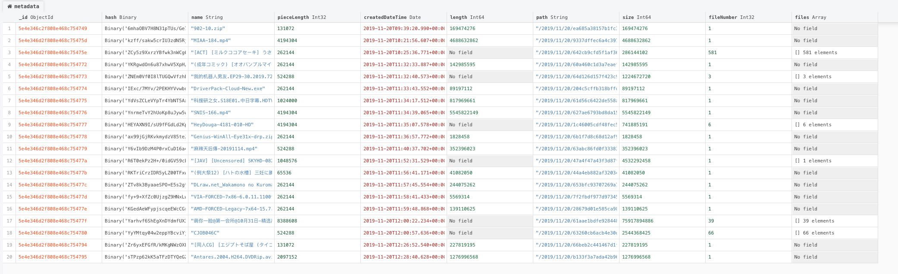

# DHT 网络爬虫


[](https://chrome.google.com/webstore/detail/transmission-web-ui/jekflgekjidcpibhnnpiimekgckgnkop)
[](https://chrome.google.com/webstore/detail/transmission-web-ui/jekflgekjidcpibhnnpiimekgckgnkop)
[](https://chrome.google.com/webstore/detail/transmission-web-ui/jekflgekjidcpibhnnpiimekgckgnkop)

[](https://microsoftedge.microsoft.com/addons/detail/transmission-web-ui/gplhiomfemapanllhkkigblmhkbmjgfc)
[](https://microsoftedge.microsoft.com/addons/detail/transmission-web-ui/gplhiomfemapanllhkkigblmhkbmjgfc)
[](https://microsoftedge.microsoft.com/addons/detail/transmission-web-ui/gplhiomfemapanllhkkigblmhkbmjgfc)

## Design

DHT Server -> Peer(Thread) -> Redis

### Module
- dht-common `Public variables and methods`
- dht-database `TODO`
- dht-krpc `krpc Protocol`
- dht-routing-table `router table`
- dht-server `Responsible for the server that transmits Bencode-encoded data over the DHT network based on the UDP transmission protocol, and the Peer client implementation (TCP), facilitating data interaction between peers to obtain the metadata and storage of the peer`

## config.properties(config file)

### DHT Server Full
```properties
#DHT Server Listen Port
server.port=6881
#Min Node number (if nodes size < min node number find node in bootstrap node)
server.nodes.min=20
#Max Node number (if node size > max node number not add to routing table)
server.nodes.max=3000
#Action(findNode) interval unit(second)
server.findNode.interval=60
#Action(ping) interval unit(second)
server.ping.interval=300
#Action(removeNode) interval unit(second)
server.removeNode.interval=300
#redis information
redis.host=127.0.0.1
redis.port=6379
redis.password=
redis.database=0
```


## Protocol

:heavy_check_mark: [DHT Protocol](http://www.bittorrent.org/beps/bep_0005.html)

:heavy_check_mark: [Extension for Peers to Send Metadata Files](http://www.bittorrent.org/beps/bep_0009.html)

:heavy_check_mark: [Extension Protocol](http://www.bittorrent.org/beps/bep_0010.html)

## Run

The jar package and the config.properties configuration file should be in the same directory

```shell script
java  -jar dht-server-full.jar &
```

## Docker

Run in Docker

[dht-server](https://hub.docker.com/repository/docker/zpqsunny/dht-server)

### ENV Config

#### DHT Server

```properties
#DHT Server Listen Port
PORT=6881
#Min Node number (if nodes size < min node number find node in bootstrap node)
MIN_NODES=20
#Max Node number (if node size > max node number not add to routing table)
MAX_NODES=5000
#redis information
REDIS_HOST=127.0.0.1
REDIS_PORT=6379
REDIS_PASSWORD=''
REDIS_DATABASE=0
```

## Fast running

**docker**
```shell
docker run -d --name redis --network host redis:5.0.10
docker run -d --name dht-server-full --network host zpqsunny/dht-server-full:latest
```

**Redis Data**

key1: `metadata` DataType: `SET`

key2: `hash:xxxx` DataType: `HASH`

**docker-compose**
```yaml
services:
  redis:
    container_name: redis
    image: redis:5.0.10
    network_mode: host
    restart: unless-stopped
  dht-server-full-1: &dht-server
    depends_on:
      - redis
    image: zpqsunny/dht-server:latest
    build:
      context: dht-server
      dockerfile: Dockerfile
    network_mode: host
    restart: unless-stopped
    environment:
      PORT: 6881
      REDIS_HOST: 127.0.0.1
      REDIS_PORT: 6379
      REDIS_PASSWORD:
      REDIS_DATABASE: 0
  dht-server-full-2:
    <<: *dht-server
    environment:
      PORT: 6882
  dht-server-full-3:
    <<: *dht-server
    environment:
      PORT: 6883
```
```shell
docker-compose up
```
## Example Data




## Stargazers over time

[](https://starchart.cc/zpqsunny/dht)

## Thanks

> [IntelliJ IDEA](https://zh.wikipedia.org/zh-hans/IntelliJ_IDEA) 是一个在各个方面都最大程度地提高开发人员的生产力的 IDE，适用于 JVM 平台语言。

特别感谢 JetBrains 为开源项目(Open Source Projects)提供免费的 [IntelliJ IDEA](https://www.jetbrains.com/) 等 IDE 的授权  

